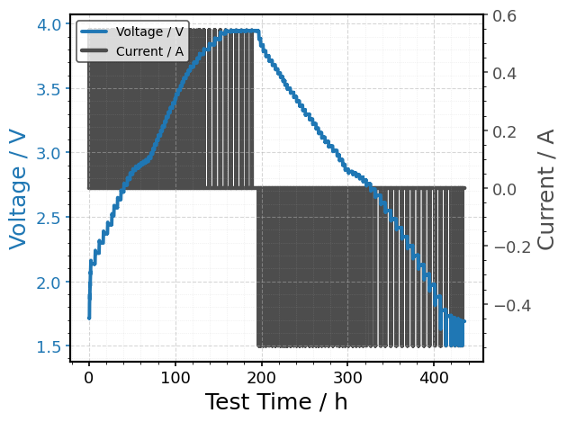

BDF Quickstart
==============

.. container:: cell markdown
   :name: abec50b5

   .. rubric:: BDF Quickstart
      :name: bdf-quickstart

   Welcome to the Battery Data Format (BDF)! This notebook shows a quick
   minimal workflow using the **BDF** package:

   #. **Read** a dataset from a defined source
   #. **Visualize** the dataset with line plots
   #. **Save** the dataset as a BDF file

.. container:: cell code
   :name: 073bf7de

   .. code:: python

      # Import the package
      import bdf

.. container:: cell code
   :name: fc9e746f

   .. code:: python

      # Read the raw source data and display the header
      df = bdf.read("https://zenodo.org/records/17289383/files/SINTEF__NaCR32140-MP10-04__2025-08-25__GITT_0p05C_25degC__BioLogic.mpt")
      df.head()

   .. container:: output execute_result

      ::

            Test Time / s  Voltage / V  Current / A  Ambient Temperature / degC  \
         0            0.0      1.71423          0.0                   23.509834   
         1           10.0     1.714152          0.0                   23.162155   
         2      20.000001     1.714152          0.0                   23.383406   
         3      30.000001      1.71423          0.0                   23.328093   
         4      40.000002     1.714191          0.0                   23.375504   

            Cycle Count / 1  
         0              0.0  
         1              0.0  
         2              0.0  
         3              0.0  
         4              0.0  

.. container:: cell code
   :name: ad5c9a9f

   .. code:: python

      # Visualize the data using the default features or a customized view
      bdf.plot(df)

   .. container:: output execute_result

      |image1|

.. container:: cell code
   :name: 1f7eb7fc

   .. code:: python

      # Visualize the data using a customized view
      bdf.plot(
          df,
          xdata="Test Time / s", xunit="h",
          ydata="Voltage / V", 
          yydata="Current / A",
      )

   .. container:: output execute_result

      |image2|

.. container:: cell code
   :name: a7c20c3d

   .. code:: python

      # Save the data as a BDF CSV
      df.to_csv("out/InstitutionCode__CellName__YYYYMMDD_XXX.bdf.csv", index=False)

.. container:: cell markdown
   :name: 1f842ce7

   .. rubric:: Next Steps
      :name: next-steps

   Additional features are comprehensively presented in dedicated
   example notebooks. We recommend exploring them in the following
   order:

   +--------------+-------------------------------------------------------+
   | Notebook     | Description                                           |
   +==============+=======================================================+
   | read.ipynb   | Load vendor/registry sources and produce a normalized |
   |              | BDF DataFrame.                                        |
   +--------------+-------------------------------------------------------+
   | va           | Run BDF schema checks and reports (incl.              |
   | lidate.ipynb | non-monotonic time warnings).                         |
   +--------------+-------------------------------------------------------+
   | units.ipynb  | Resolve/convert units with Pint; map labels/IRIs/MR   |
   |              | names to units.                                       |
   +--------------+-------------------------------------------------------+
   | visuali      | Plot BDF data with clean styling and on-the-fly unit  |
   | zation.ipynb | conversions.                                          |
   +--------------+-------------------------------------------------------+
   | repair.ipynb | Fix timestamps, clean columns, and apply other data   |
   |              | repair utilities.                                     |
   +--------------+-------------------------------------------------------+
   | me           | Generate schema.org + CSVW JSON-LD metadata for       |
   | tadata.ipynb | datasets and distributions.                           |
   +--------------+-------------------------------------------------------+

.. |image1| image:: ../_static/examples/86bd863453cdf7e70dc0dbd2ce063435847029a6.png

