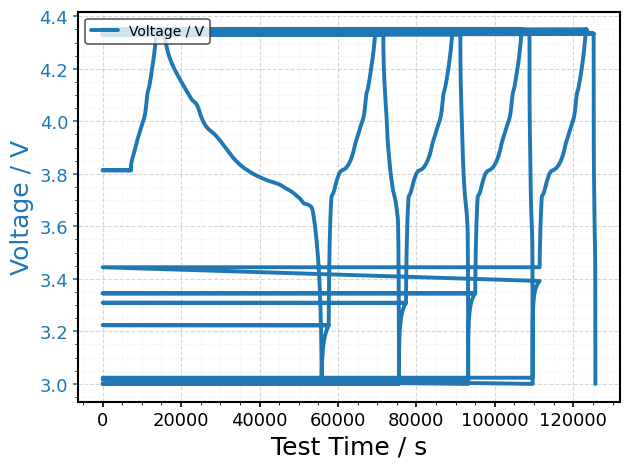
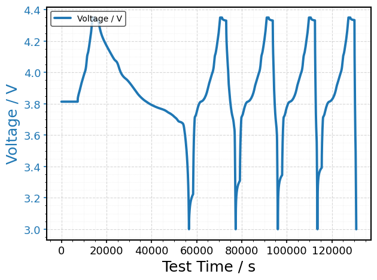

Repair datasets with common bugs
================================

.. container:: cell markdown
   :name: cb43647e

   .. rubric:: Repair datasets with common bugs
      :name: repair-datasets-with-common-bugs

   Export routines from battery test equipment can sometimes insert bugs
   like non-monotonic times. We have included some functions to
   recognize these occurences during validation along with some basic
   tools to repair them.

.. container:: cell code
   :name: 9639d4b2

   .. code:: python

      import bdf

.. container:: cell code
   :name: b037504c

   .. code:: python

      # Read the raw source data and display the header
      df = bdf.read("https://zenodo.org/records/17295469/files/SINTEF__SLPBA842124HV__2024-10-23__Rate_25degC__Neware__Time_Bug.csv")

   .. container:: output stream stderr

      ::

         RuntimeWarning [bdf.validate:83]: Non-monotonic 'Test Time / s' detected: 19 drops (min Δ = -125193 s). Consider bdf.fix_time(...).

.. container:: cell code
   :name: 81d52780

   .. code:: python

      bdf.plot(df)

   .. container:: output execute_result

      |image1|

.. container:: cell code
   :name: c4ae1907

   .. code:: python

      # Fix non-monotonic time
      df = bdf.fix_time(df, method="auto")

.. container:: cell code
   :name: 1588bcb6

   .. code:: python

      # Visualize the repaired dataset
      bdf.plot(df)

   .. container:: output execute_result

      |image2|

