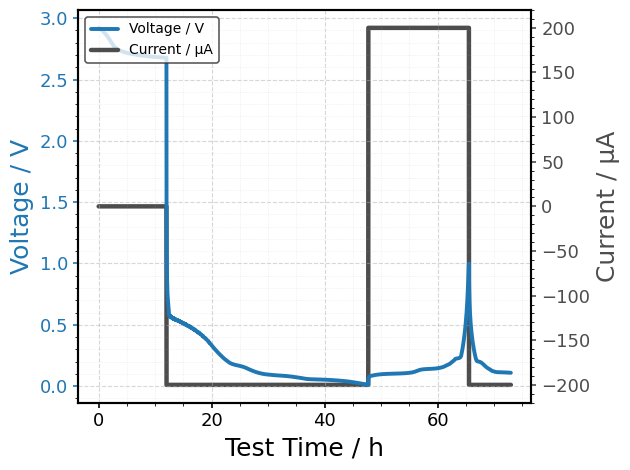

Units handling
==============

.. container:: cell markdown
   :name: 8c180f6b

   .. rubric:: Units handling
      :name: units-handling

   Handling units in BDF relies on established resources like pint,
   QUDT, and EMMO. This mini notebook shows how to:

   - Resolve a unit from different identifiers (canonical label,
     machine-readable name, IRI, or raw string)
   - Convert pandas.Series between units (with metadata-aware inference)
   - Use unit overrides in plotting

.. container:: cell code
   :name: 0f34f6bd

   .. code:: python

      import bdf
      from bdf.units import resolve_unit, convert

.. container:: cell code
   :name: 098a8d0f

   .. code:: python

      # Retrieve the unit from the preferred label
      print(resolve_unit("Voltage / V"))

      # Retrieve the unit from the vendor specific label
      print(resolve_unit("AhAccu#Ah"))

      # Retrieve the unit from the BDF machine readable name
      print(resolve_unit("specific_capacity_milliampere_hour_per_gram"))

      # Retrieve the unit from the BDF IRI
      print(resolve_unit("https://w3id.org/battery-data-alliance/ontology/battery-data-format#discharging_capacity_ah", as_string=True))

   .. container:: output stream stdout

      ::

         volt
         ampere * hour
         hour * milliampere / gram
         Ah

.. container:: cell code
   :name: 01feddf2

   .. code:: python

      # Read from a local file path
      filepath = "../data/SINTEF__LiGrR2032__2024-04-30__25degC__Landt.csv"

      df = bdf.read(filepath)
      df.head()

   .. container:: output execute_result

      ::

           Test Time / s Voltage / V Current / A Step Index / 1  \
         0         0.020      2.9215      0.0000              1   
         1        15.020      2.9215      0.0000              1   
         2        30.020      2.9214      0.0000              1   
         3        45.020      2.9214      0.0000              1   
         4        60.020      2.9213      0.0000              1   

           Discharging Capacity / Ah Charging Capacity / Ah Ambient Temperature / degC  
         0                         0                      0                          0  
         1                         0                      0                          0  
         2                         0                      0                          0  
         3                         0                      0                          0  
         4                         0                      0                          0  

.. container:: cell code
   :name: f41443f6

   .. code:: python

      # Convert units from the source data and save it as a new dataframe
      import pandas as pd
      df_converted = pd.DataFrame()

      # time s -> h
      df_converted["Test Time / h"] = convert(df["Test Time / s"], "h")

      # voltage V -> mV
      df_converted["Voltage / mV"] = convert(df["Voltage / V"], "mV")

      # current A -> mA
      df_converted["Current / mA"] = convert(df["Current / A"], "mA")

      # capacity Ah -> mAh
      df_converted["Charging Capacity / mAh"] = convert(df["Charging Capacity / Ah"], "mAh")

      df_converted.head()

   .. container:: output execute_result

      ::

            Test Time / h  Voltage / mV  Current / mA  Charging Capacity / mAh
         0       0.000006        2921.5           0.0                      0.0
         1       0.004172        2921.5           0.0                      0.0
         2       0.008339        2921.4           0.0                      0.0
         3       0.012506        2921.4           0.0                      0.0
         4       0.016672        2921.3           0.0                      0.0

.. container:: cell code
   :name: c302a572

   .. code:: python

      # Unit conversions can also be done directly in the plot function without additional steps
      bdf.plot(
          df,
          xdata="Test Time / s", xunit="h",
          ydata="Voltage / V",
          yydata="Current / A", yyunit="µA"
      )

   .. container:: output execute_result

      |image1|

