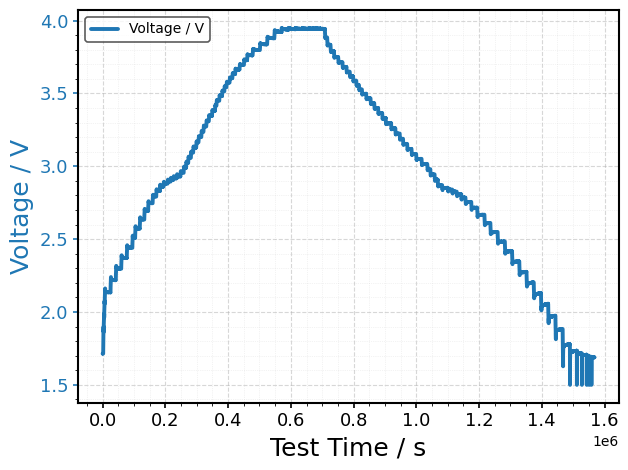
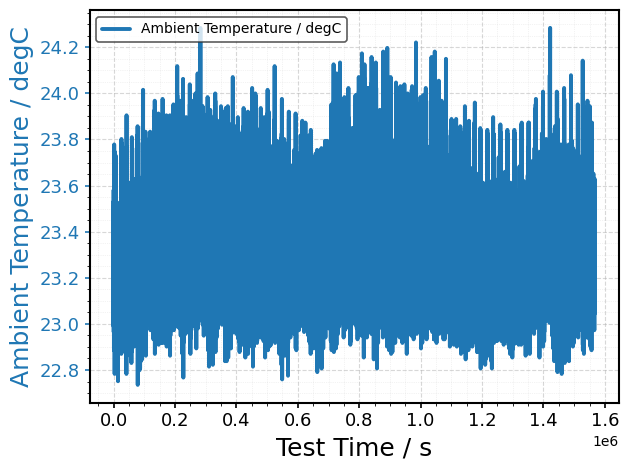
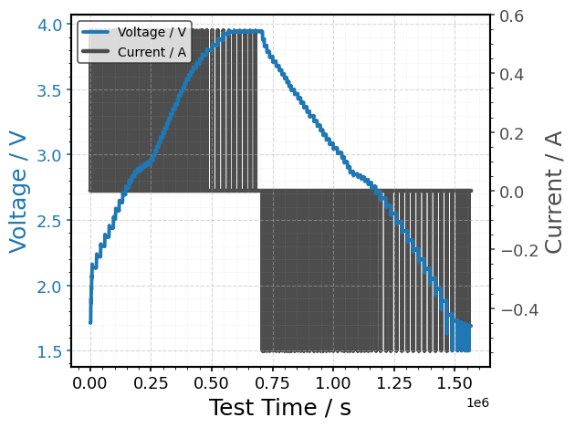
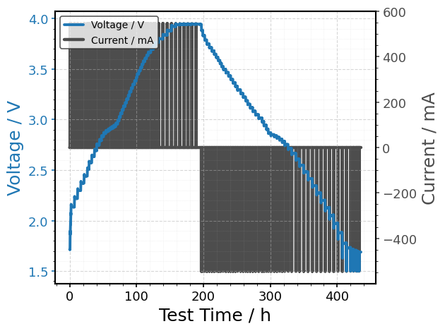

Visualize a dataset
===================

.. container:: cell markdown
   :name: fb56b59f

   .. rubric:: Visualize a dataset
      :name: visualize-a-dataset

   The package includes basic tools to visualize BDF data as line plots.
   This notebook demonstrates the core functionality, including:

   - default plotting of a minimal dataset
   - custom plotting of defined quantities
   - adding a secondary axis to the plot
   - converting units in the plot

.. container:: cell code
   :name: 03e4df9b

   .. code:: python

      import bdf

.. container:: cell code
   :name: b16aea6f

   .. code:: python

      # Read the raw source data and display the header
      df = bdf.read("https://zenodo.org/records/17289383/files/SINTEF__NaCR32140-MP10-04__2025-08-25__GITT_0p05C_25degC__BioLogic.mpt")

.. container:: cell code
   :name: 8ffd5333

   .. code:: python

      # The package plots Voltage / V versus Test Time / s by default, if no other information is provided
      bdf.plot(df)

   .. container:: output execute_result

      |image1|

.. container:: cell code
   :name: 7a97f069

   .. code:: python

      # The user can also make custom plots from the dataframe
      bdf.plot(
          df,
          xdata="Test Time / s",
          ydata="Ambient Temperature / degC"
      )

   .. container:: output execute_result

      |image2|

.. container:: cell code
   :name: 58d3111e

   .. code:: python

      # The yydata option can be added to introduce a secondary axis
      bdf.plot(
          df,
          xdata="Test Time / s",
          ydata="Voltage / V",
          yydata="Current / A"
      )

   .. container:: output execute_result

      |image3|

.. container:: cell code
   :name: 3fcfb567

   .. code:: python

      # Unit conversions can also be done directly in the plot function without additional steps
      bdf.plot(
          df,
          xdata="Test Time / s", xunit="h",
          ydata="Voltage / V",
          yydata="Current / A", yyunit="mA"
      )

   .. container:: output execute_result

      |image4|

