Reference Datasets
==================

Real cycler measurements from the vendors BDF supports, each converted from a `raw export on Zenodo <https://doi.org/10.5281/zenodo.18986774>`__ (CC-BY-4.0) and validated in CI on every commit. On-disk column keys are the versioned `BDF ontology <https://battery-data-alliance.github.io/battery-data-format-ontology/pages/specification.html>`__ notation (``test_time_second``, ``voltage_volt``, …); ``bdf.read`` exposes them under the human labels (``Test Time / s``, …), and both round-trip losslessly. Files with a ``__*_Bug`` filename suffix keep real acquisition defects on purpose, to exercise ``bdf.clean``; everything else is clean.

.. BEGIN GENERATED: reference-datasets

.. Generated by docs/_ext/generate_reference_datasets_doc.py from docs/examples/reference/datasets.json - do not edit by hand.

Plugin scorecards
-----------------

Each row scores a *converter*: every artifact is re-converted from raw and cross-checked;
**FAIL** means a disagreement or failed check, detailed on the dataset's card below.

.. list-table::
   :header-rows: 1
   :widths: 22 10 12 12 14 12 12

   * - Plugin
     - Verdict
     - Datasets
     - Rows
     - Mapped
     - Dropped
     - Findings
   * - `basytec_txt <#basytec-txt>`__
     - :bdg-success:`PASS`
     - 4
     - 695,784
     - 24/68
     - 44
     - —
   * - `digatron_csv <#digatron-csv>`__
     - :bdg-danger:`FAIL`
     - 1
     - 47,927
     - 17/22
     - 5
     - 2
   * - `neware_nda <#neware-nda>`__
     - :bdg-success:`PASS`
     - 1
     - 17,587
     - 12/12
     - 0
     - —
   * - `landt_csv <#landt-csv>`__
     - :bdg-success:`PASS`
     - 1
     - 25,162
     - 16/17
     - 1
     - —
   * - `biologic_mpt <#biologic-mpt>`__
     - :bdg-success:`PASS`
     - 2
     - 270,819
     - 24/64
     - 40
     - 3
   * - `neware_csv <#neware-csv>`__
     - :bdg-success:`PASS`
     - 1
     - 13,086
     - 12/34
     - 22
     - —
   * - `novonix_csv <#novonix-csv>`__
     - :bdg-success:`PASS`
     - 1
     - 817,551
     - 14/16
     - 2
     - —
   * - `maccor_csv <#maccor-csv>`__
     - :bdg-success:`PASS`
     - 1
     - 6,313
     - 12/15
     - 3
     - —
   * - `arbin_csv <#arbin-csv>`__
     - :bdg-success:`PASS`
     - 1
     - 131,884
     - 12/26
     - 14
     - —

basytec_txt
-----------

4 reference dataset(s) exercising the ``basytec_txt`` parser and normalizer.

DLR__LiGrHydra0b__20221114__GITT__25degC__Basytec.bdf.csv
~~~~~~~~~~~~~~~~~~~~~~~~~~~~~~~~~~~~~~~~~~~~~~~~~~~~~~~~~

GITT protocol, Li-Gr full cell, 25 degC. Regenerated 2026-07-13: the legacy conversion carried test_time_second values 3600x too large (hours-to-seconds applied twice); the temperature channel, previously published as ambient_temperature_celsius, is now the unqualified temperature_t1_celsius per the aux-channel policy (raw header T1[degC]; identical values; placement confirmation requested from DLR); Step ID and Record Index are newly extracted.

- **Provider:** DLR
- **Rows:** 315,306
- **BDF artifact:** ``docs/examples/reference/DLR__LiGrHydra0b__20221114__GITT__25degC__Basytec.bdf.csv`` (sha256 ``cfc400994e25...``)
- **Raw export:** `DLR__LiGrHydra0b__20221114__GITT__25degC__Basytec.txt <https://zenodo.org/api/records/18986774/files/DLR__LiGrHydra0b__20221114__GITT__25degC__Basytec.txt/content>`__ (59.5 MiB, md5:26eb1804d891c87bff7af244927be602)

- **Columns:** ``test_time_second``, ``voltage_volt``, ``current_ampere``, ``step_id``, ``record_index``, ``temperature_t1_celsius``

:bdg-success:`PASS` 315,306 rows — 614.8 h — Voltage / V: [0.0097, 1.5149] — Current / A: [-0.0007, 0.0007]

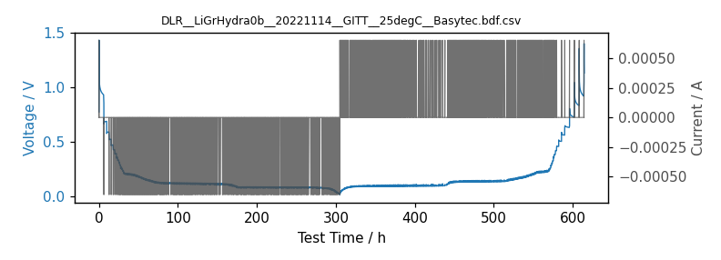

- ✓ raw-vs-artifact: matches fresh conversion
- ✓ derived-column consistency: no findings

.. dropdown:: Column mapping (6 mapped, 11 native columns dropped)

   .. list-table::
      :header-rows: 1
      :widths: 40 40 20

      * - Native column
        - BDF column
        - Conversion
      * - ``I[A]``
        - ``Current / A``
        - 1:1
      * - ``DataSet``
        - ``Record Index / 1``
        - 1:1
      * - ``Line``
        - ``Step ID``
        - 1:1
      * - ``T1[°C]``
        - ``Temperature T1 / degC``
        - 1:1
      * - ``~Time[h]``
        - ``Test Time / s``
        - x 3600
      * - ``U[V]``
        - ``Voltage / V``
        - 1:1

   **Dropped (no BDF mapping):** ``t-Set[h]``, ``Command``, ``Ah[Ah/kg]``, ``Ah-Charge``, ``Ah-Discharge``, ``Ah-Step``, ``Ah-Step[Ah/kg]``, ``Ah-Set``, ``Ah-Set[Ah/kg]``, ``Cyc-Count``, ``State``

DLR__LiGrHydra0b__20230131__POCV__25degC__Basytec.bdf.csv
~~~~~~~~~~~~~~~~~~~~~~~~~~~~~~~~~~~~~~~~~~~~~~~~~~~~~~~~~

Pseudo-OCV protocol, Li-Gr full cell, 25 degC. Regenerated 2026-07-13: the legacy conversion carried test_time_second values 3600x too large (hours-to-seconds applied twice); the temperature channel, previously published as ambient_temperature_celsius, is now the unqualified temperature_t1_celsius per the aux-channel policy (raw header T1[degC]; identical values; placement confirmation requested from DLR); Step ID and Record Index are newly extracted.

- **Provider:** DLR
- **Rows:** 39,193
- **BDF artifact:** ``docs/examples/reference/DLR__LiGrHydra0b__20230131__POCV__25degC__Basytec.bdf.csv`` (sha256 ``c73d4465ff34...``)
- **Raw export:** `DLR__LiGrHydra0b__20230131__POCV__25degC__Basytec.txt <https://zenodo.org/api/records/18986774/files/DLR__LiGrHydra0b__20230131__POCV__25degC__Basytec.txt/content>`__ (8.8 MiB, md5:9e5b47be4a13c71a66d20714d3e016b6)

- **Columns:** ``test_time_second``, ``voltage_volt``, ``current_ampere``, ``step_id``, ``record_index``, ``temperature_t1_celsius``

:bdg-success:`PASS` 39,193 rows — 102.95 h — Voltage / V: [0.0097, 1.5021] — Current / A: [-0.0001, 0.0001]

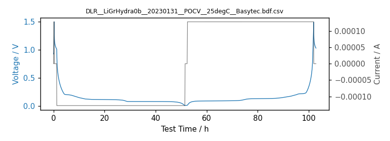

- ✓ raw-vs-artifact: matches fresh conversion
- ✓ derived-column consistency: no findings

.. dropdown:: Column mapping (6 mapped, 11 native columns dropped)

   .. list-table::
      :header-rows: 1
      :widths: 40 40 20

      * - Native column
        - BDF column
        - Conversion
      * - ``I[A]``
        - ``Current / A``
        - 1:1
      * - ``DataSet``
        - ``Record Index / 1``
        - 1:1
      * - ``Line``
        - ``Step ID``
        - 1:1
      * - ``T1[°C]``
        - ``Temperature T1 / degC``
        - 1:1
      * - ``~Time[h]``
        - ``Test Time / s``
        - x 3600
      * - ``U[V]``
        - ``Voltage / V``
        - 1:1

   **Dropped (no BDF mapping):** ``t-Set[h]``, ``Command``, ``Ah[Ah/kg]``, ``Ah-Charge``, ``Ah-Discharge``, ``Ah-Step``, ``Ah-Step[Ah/kg]``, ``Ah-Set``, ``Ah-Set[Ah/kg]``, ``Cyc-Count``, ``State``

DLR__LiLNMOHydra0b__20221125__POCV__25degC__Basytec.bdf.csv
~~~~~~~~~~~~~~~~~~~~~~~~~~~~~~~~~~~~~~~~~~~~~~~~~~~~~~~~~~~

Pseudo-OCV protocol, Li-LNMO full cell, 25 degC. Regenerated 2026-07-13: the legacy conversion carried test_time_second values 3600x too large (hours-to-seconds applied twice); the temperature channel, previously published as ambient_temperature_celsius, is now the unqualified temperature_t1_celsius per the aux-channel policy (raw header T1[degC]; identical values; placement confirmation requested from DLR); Step ID and Record Index are newly extracted.

- **Provider:** DLR
- **Rows:** 17,860
- **BDF artifact:** ``docs/examples/reference/DLR__LiLNMOHydra0b__20221125__POCV__25degC__Basytec.bdf.csv`` (sha256 ``7f8f980f25bd...``)
- **Raw export:** `DLR__LiLNMOHydra0b__20221125__POCV__25degC__Basytec.txt <https://zenodo.org/api/records/18986774/files/DLR__LiLNMOHydra0b__20221125__POCV__25degC__Basytec.txt/content>`__ (3.9 MiB, md5:5e6bd90f2f01b777fe871e7f867d3ee0)

- **Columns:** ``test_time_second``, ``voltage_volt``, ``current_ampere``, ``step_id``, ``record_index``, ``temperature_t1_celsius``

:bdg-success:`PASS` 17,860 rows — 40.93 h — Voltage / V: [2.9938, 4.9001] — Current / A: [-0.0003, 0.0003]

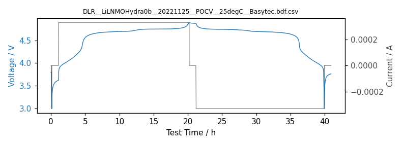

- ✓ raw-vs-artifact: matches fresh conversion
- ✓ derived-column consistency: no findings

.. dropdown:: Column mapping (6 mapped, 11 native columns dropped)

   .. list-table::
      :header-rows: 1
      :widths: 40 40 20

      * - Native column
        - BDF column
        - Conversion
      * - ``I[A]``
        - ``Current / A``
        - 1:1
      * - ``DataSet``
        - ``Record Index / 1``
        - 1:1
      * - ``Line``
        - ``Step ID``
        - 1:1
      * - ``T1[°C]``
        - ``Temperature T1 / degC``
        - 1:1
      * - ``~Time[h]``
        - ``Test Time / s``
        - x 3600
      * - ``U[V]``
        - ``Voltage / V``
        - 1:1

   **Dropped (no BDF mapping):** ``t-Set[h]``, ``Command``, ``Ah[Ah/kg]``, ``Ah-Charge``, ``Ah-Discharge``, ``Ah-Step``, ``Ah-Step[Ah/kg]``, ``Ah-Set``, ``Ah-Set[Ah/kg]``, ``Cyc-Count``, ``State``

DLR__LiLNMOHydra0b__20221130__GITT__25degC__Basytec.bdf.csv
~~~~~~~~~~~~~~~~~~~~~~~~~~~~~~~~~~~~~~~~~~~~~~~~~~~~~~~~~~~

GITT protocol, Li-LNMO full cell, 25 degC. Regenerated 2026-07-13: the legacy conversion carried test_time_second values 3600x too large (hours-to-seconds applied twice); the temperature channel, previously published as ambient_temperature_celsius, is now the unqualified temperature_t1_celsius per the aux-channel policy (raw header T1[degC]; identical values; placement confirmation requested from DLR); Step ID and Record Index are newly extracted.

- **Provider:** DLR
- **Rows:** 323,425
- **BDF artifact:** ``docs/examples/reference/DLR__LiLNMOHydra0b__20221130__GITT__25degC__Basytec.bdf.csv`` (sha256 ``b54df597404a...``)
- **Raw export:** `DLR__LiLNMOHydra0b__20221130__GITT__25degC__Basytec.txt <https://zenodo.org/api/records/18986774/files/DLR__LiLNMOHydra0b__20221130__GITT__25degC__Basytec.txt/content>`__ (60.1 MiB, md5:4c72b750dead3747e9bfe82413ecc9cd)

- **Columns:** ``test_time_second``, ``voltage_volt``, ``current_ampere``, ``step_id``, ``record_index``, ``temperature_t1_celsius``

:bdg-success:`PASS` 323,425 rows — 625.77 h — Voltage / V: [2.9882, 4.9006] — Current / A: [-0.0006, 0.0006]

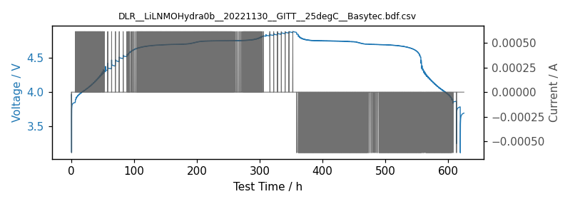

- ✓ raw-vs-artifact: matches fresh conversion
- ✓ derived-column consistency: no findings

.. dropdown:: Column mapping (6 mapped, 11 native columns dropped)

   .. list-table::
      :header-rows: 1
      :widths: 40 40 20

      * - Native column
        - BDF column
        - Conversion
      * - ``I[A]``
        - ``Current / A``
        - 1:1
      * - ``DataSet``
        - ``Record Index / 1``
        - 1:1
      * - ``Line``
        - ``Step ID``
        - 1:1
      * - ``T1[°C]``
        - ``Temperature T1 / degC``
        - 1:1
      * - ``~Time[h]``
        - ``Test Time / s``
        - x 3600
      * - ``U[V]``
        - ``Voltage / V``
        - 1:1

   **Dropped (no BDF mapping):** ``t-Set[h]``, ``Command``, ``Ah[Ah/kg]``, ``Ah-Charge``, ``Ah-Discharge``, ``Ah-Step``, ``Ah-Step[Ah/kg]``, ``Ah-Set``, ``Ah-Set[Ah/kg]``, ``Cyc-Count``, ``State``

digatron_csv
------------

1 reference dataset(s) exercising the ``digatron_csv`` parser and normalizer.

FZJ__INR21700__20250606__HPPC__25degC__Digatron.bdf.csv
~~~~~~~~~~~~~~~~~~~~~~~~~~~~~~~~~~~~~~~~~~~~~~~~~~~~~~~

HPPC protocol, INR21700 cell, 25 degC.

- **Provider:** FZJ
- **Rows:** 47,927
- **BDF artifact:** ``docs/examples/reference/FZJ__INR21700__20250606__HPPC__25degC__Digatron.bdf.csv`` (sha256 ``4dda9f11bc8f...``)
- **Raw export:** `FZJ__INR21700__20250606__HPPC__25degC__Digatron.csv <https://zenodo.org/api/records/18986774/files/FZJ__INR21700__20250606__HPPC__25degC__Digatron.csv/content>`__ (12.7 MiB, md5:ef75214f8bca7f9654a2524f7db364b0)

- **Columns:** ``test_time_second``, ``voltage_volt``, ``current_ampere``, ``unix_time_second``, ``step_id``, ``step_type``, ``ambient_temperature_celsius``, ``step_time_second``, ``charging_capacity_ah``, ``discharging_capacity_ah``, ``net_capacity_ah``, ``step_cumulative_capacity_ah``, ``charging_energy_wh``, ``discharging_energy_wh``, ``net_energy_wh``, ``step_cumulative_energy_wh``, ``temperature_t1_celsius``

:bdg-danger:`FAIL` 47,927 rows — 13,280.94 h — Voltage / V: [2.5, 4.2001] — Current / A: [-5.0, 5.0001]

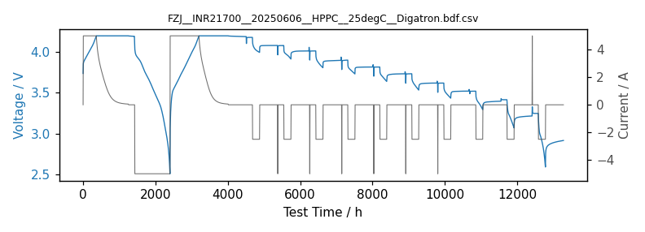

- **Time-scale cross-check:** Test Time / s increments are 1000x the wall-clock increments: values are milliseconds stored under a seconds header (see battery-data-format#65)
- ✓ raw-vs-artifact: matches fresh conversion
- ✗ derived: ``'net_capacity_ah' != charging_capacity_ah - discharging_capacity_ah in 76/47927 rows (worst |Δ| = 2.671e-08).``

.. dropdown:: Column mapping (17 mapped, 5 native columns dropped)

   .. list-table::
      :header-rows: 1
      :widths: 40 40 20

      * - Native column
        - BDF column
        - Conversion
      * - ``Tenv#degC``
        - ``Ambient Temperature / degC``
        - 1:1
      * - ``AhCha#AH``
        - ``Charging Capacity / Ah``
        - 1:1
      * - ``WhCha#Wh``
        - ``Charging Energy / Wh``
        - 1:1
      * - ``Current#A``
        - ``Current / A``
        - 1:1
      * - ``AhDch#Ah``
        - ``Discharging Capacity / Ah``
        - 1:1
      * - ``WhDch#Wh``
        - ``Discharging Energy / Wh``
        - 1:1
      * - ``AhAccu#Ah``
        - ``Net Capacity / Ah``
        - 1:1
      * - ``WhAccu#Wh``
        - ``Net Energy / Wh``
        - 1:1
      * - ``AhStep#Ah``
        - ``Step Cumulative Capacity / Ah``
        - 1:1
      * - ``WhStep#Wh``
        - ``Step Cumulative Energy / Wh``
        - 1:1
      * - ``Step``
        - ``Step ID``
        - 1:1
      * - ``Step Duration#s``
        - ``Step Time / s``
        - 1:1
      * - ``Status``
        - ``Step Type``
        - 1:1
      * - ``T1#degC``
        - ``Temperature T1 / degC``
        - 1:1
      * - ``Program Duration#s``
        - ``Test Time / s``
        - 1:1
      * - ``Timestamp``
        - ``Unix Time / s``
        - datetime parse
      * - ``Voltage#V``
        - ``Voltage / V``
        - 1:1

   **Dropped (no BDF mapping):** ``Cycle``, ``Cycle Level``, ``Procedure``, ``Procedure Level``, ``AhBal#Ah``

neware_nda
----------

1 reference dataset(s) exercising the ``neware_nda`` parser and normalizer.

SINTEF__G20M7-202512-Gru6mV__20251228__C30__25degC__Neware.bdf.csv
~~~~~~~~~~~~~~~~~~~~~~~~~~~~~~~~~~~~~~~~~~~~~~~~~~~~~~~~~~~~~~~~~~

C/30 slow cycle, sodium-ion cell, 25 degC. Binary Neware NDA source.

- **Provider:** SINTEF
- **Rows:** 17,587
- **BDF artifact:** ``docs/examples/reference/SINTEF__G20M7-202512-Gru6mV__20251228__C30__25degC__Neware.bdf.csv`` (sha256 ``52a853ba9e21...``)
- **Raw export:** `SINTEF__G20M7-202512-Gru6mV__20251228__C30__25degC__Neware.nda <https://zenodo.org/api/records/18986774/files/SINTEF__G20M7-202512-Gru6mV__20251228__C30__25degC__Neware.nda/content>`__ (0.9 MiB, md5:ff7c20a432d8c17be210adec09e484e6)

- **Columns:** ``test_time_second``, ``voltage_volt``, ``current_ampere``, ``unix_time_second``, ``cycle_count``, ``step_count``, ``step_id``, ``step_type``, ``record_index``, ``step_time_second``, ``step_net_capacity_ah``, ``step_net_energy_wh``

:bdg-success:`PASS` 17,587 rows — 48.82 h — Voltage / V: [2.9999, 4.2002] — Current / A: [-0.165, 0.1651]

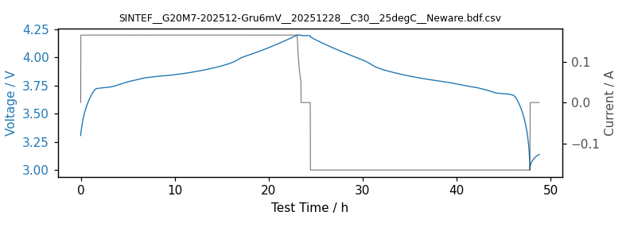

- ✓ raw-vs-artifact: matches fresh conversion
- ✓ derived-column consistency: no findings

.. dropdown:: Column mapping (12 mapped, 0 native columns dropped)

   .. list-table::
      :header-rows: 1
      :widths: 40 40 20

      * - Native column
        - BDF column
        - Conversion
      * - ``current_mA``
        - ``Current / A``
        - x 0.001
      * - ``cycle_count``
        - ``Cycle Count / 1``
        - 1:1
      * - ``index``
        - ``Record Index / 1``
        - 1:1
      * - ``step_count``
        - ``Step Count / 1``
        - 1:1
      * - ``step_index``
        - ``Step ID``
        - 1:1
      * - ``capacity_mAh``
        - ``Step Net Capacity / Ah``
        - x 0.001
      * - ``energy_mWh``
        - ``Step Net Energy / Wh``
        - x 0.001
      * - ``step_time_s``
        - ``Step Time / s``
        - 1:1
      * - ``step_type``
        - ``Step Type``
        - 1:1
      * - ``total_time_s``
        - ``Test Time / s``
        - 1:1
      * - ``unix_time_s``
        - ``Unix Time / s``
        - 1:1
      * - ``voltage_V``
        - ``Voltage / V``
        - 1:1

landt_csv
---------

1 reference dataset(s) exercising the ``landt_csv`` parser and normalizer.

SINTEF__LiGrR2032__2024-04-30__25degC__Landt.bdf.csv
~~~~~~~~~~~~~~~~~~~~~~~~~~~~~~~~~~~~~~~~~~~~~~~~~~~~

Li-Gr coin cell, 25 degC. The same measurement is available as both a LANDT CSV and TXT export; both normalize to this file (the TXT via the landt_txt plugin).

- **Provider:** SINTEF
- **Rows:** 25,162
- **BDF artifact:** ``docs/examples/reference/SINTEF__LiGrR2032__2024-04-30__25degC__Landt.bdf.csv`` (sha256 ``e7ea478aa3fd...``)
- **Raw export:** `SINTEF__LiGrR2032__2024-04-30__25degC__Landt.csv <https://zenodo.org/api/records/18986774/files/SINTEF__LiGrR2032__2024-04-30__25degC__Landt.csv/content>`__ (2.5 MiB, md5:819f9f245126cce4f538e3a3d5883636)
- **Raw export:** `SINTEF__LiGrR2032__2024-04-30__25degC__Landt.txt <https://zenodo.org/api/records/18986774/files/SINTEF__LiGrR2032__2024-04-30__25degC__Landt.txt/content>`__ (2.7 MiB, md5:fdfa79a7881662ba5d871a8d7d5357b1)

- **Columns:** ``test_time_second``, ``voltage_volt``, ``current_ampere``, ``unix_time_second``, ``cycle_count``, ``step_id``, ``step_type``, ``record_index``, ``step_time_second``, ``step_charging_capacity_ah``, ``step_discharging_capacity_ah``, ``step_charging_energy_wh``, ``step_discharging_energy_wh``, ``temperature_t1_celsius``, ``temperature_t2_celsius``, ``temperature_t3_celsius``

:bdg-success:`PASS` 25,162 rows — 72.96 h — Voltage / V: [0.01, 2.9215] — Current / A: [-0.0002, 0.0002]

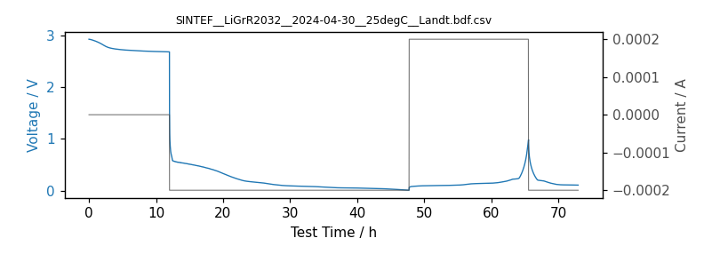

- ✓ raw-vs-artifact: matches fresh conversion
- ✓ derived-column consistency: no findings

.. dropdown:: Column mapping (16 mapped, 1 native columns dropped)

   .. list-table::
      :header-rows: 1
      :widths: 40 40 20

      * - Native column
        - BDF column
        - Conversion
      * - ``current_A``
        - ``Current / A``
        - 1:1
      * - ``cycle_index``
        - ``Cycle Count / 1``
        - 1:1
      * - ``channel_index``
        - ``Record Index / 1``
        - 1:1
      * - ``charge_capacity_Ah``
        - ``Step Charging Capacity / Ah``
        - 1:1
      * - ``charge_energy_Wh``
        - ``Step Charging Energy / Wh``
        - 1:1
      * - ``discharge_capacity_Ah``
        - ``Step Discharging Capacity / Ah``
        - 1:1
      * - ``discharge_energy_Wh``
        - ``Step Discharging Energy / Wh``
        - 1:1
      * - ``step_index``
        - ``Step ID``
        - 1:1
      * - ``step_time_s``
        - ``Step Time / s``
        - 1:1
      * - ``step_name``
        - ``Step Type``
        - 1:1
      * - ``temperature_1_C``
        - ``Temperature T1 / degC``
        - 1:1
      * - ``temperature_2_C``
        - ``Temperature T2 / degC``
        - 1:1
      * - ``temperature_3_C``
        - ``Temperature T3 / degC``
        - 1:1
      * - ``test_time_s``
        - ``Test Time / s``
        - 1:1
      * - ``date_time_iso_string``
        - ``Unix Time / s``
        - datetime parse
      * - ``voltage_V``
        - ``Voltage / V``
        - 1:1

   **Dropped (no BDF mapping):** ``Pressure_Psi``

biologic_mpt
------------

2 reference dataset(s) exercising the ``biologic_mpt`` parser and normalizer.

SINTEF__NaCR32140-MP10-04__2025-08-25__CCCV_0p02C_25degC__BioLogic__Outlier_Bug.bdf.csv
~~~~~~~~~~~~~~~~~~~~~~~~~~~~~~~~~~~~~~~~~~~~~~~~~~~~~~~~~~~~~~~~~~~~~~~~~~~~~~~~~~~~~~~

CCCV C/50 protocol, sodium-ion cell, 25 degC.

.. warning::

   **Deliberately imperfect data.** Contains physically implausible voltage outlier spikes exactly as logged by the instrument. Kept on purpose to demonstrate outlier repair with bdf.clean. The same instrument glitches corrupt the vendor energy accumulators: the net-energy identity is violated by up to 15.5 Wh and the charging/discharging energy columns are non-monotonic, exactly as exported.

- **Provider:** SINTEF
- **Rows:** 112,834
- **BDF artifact:** ``docs/examples/reference/SINTEF__NaCR32140-MP10-04__2025-08-25__CCCV_0p02C_25degC__BioLogic__Outlier_Bug.bdf.csv`` (sha256 ``b01ea95116c5...``)
- **Raw export:** `SINTEF__NaCR32140-MP10-04__2025-08-25__CCCV_0p02C_25degC__BioLogic__Outlier_Bug.mpt <https://zenodo.org/api/records/18986774/files/SINTEF__NaCR32140-MP10-04__2025-08-25__CCCV_0p02C_25degC__BioLogic__Outlier_Bug.mpt/content>`__ (51.1 MiB, md5:627f276281d2de9ad3ffe9494c7b115d)

- **Columns:** ``test_time_second``, ``voltage_volt``, ``current_ampere``, ``cycle_count``, ``step_id``, ``step_time_second``, ``net_capacity_ah``, ``charging_energy_wh``, ``discharging_energy_wh``, ``net_energy_wh``, ``power_watt``, ``internal_resistance_ohm``

:bdg-success:`PASS` 112,834 rows — 313.23 h — Voltage / V: [1.4999, 4.0195] — Current / A: [-0.2003, 0.2014]

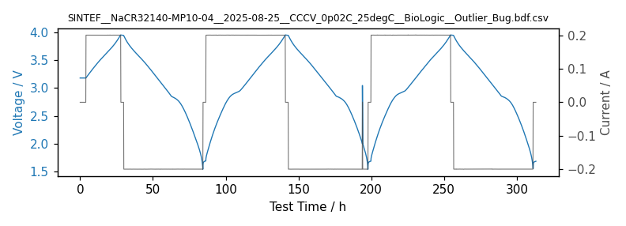

- ✓ raw-vs-artifact: matches fresh conversion
- ✗ derived: ``'net_energy_wh' != charging_energy_wh - discharging_energy_wh in 81731/112834 rows (worst |Δ| = 15.55).``
- ✗ derived: ``'charging_energy_wh' is not monotonically non-decreasing (2 drops).``
- ✗ derived: ``'discharging_energy_wh' is not monotonically non-decreasing (3 drops).``

.. dropdown:: Column mapping (12 mapped, 20 native columns dropped)

   .. list-table::
      :header-rows: 1
      :widths: 40 40 20

      * - Native column
        - BDF column
        - Conversion
      * - ``Energy charge/W.h``
        - ``Charging Energy / Wh``
        - 1:1
      * - ``I/mA``
        - ``Current / A``
        - x 0.001
      * - ``cycle number``
        - ``Cycle Count / 1``
        - 1:1
      * - ``Energy discharge/W.h``
        - ``Discharging Energy / Wh``
        - 1:1
      * - ``R/Ohm``
        - ``Internal Resistance / ohm``
        - 1:1
      * - ``(Q-Qo)/mA.h``
        - ``Net Capacity / Ah``
        - x 0.001
      * - ``Energy/W.h``
        - ``Net Energy / Wh``
        - 1:1
      * - ``P/W``
        - ``Power / W``
        - 1:1
      * - ``Ns``
        - ``Step ID``
        - 1:1
      * - ``step time/s``
        - ``Step Time / s``
        - 1:1
      * - ``time/s``
        - ``Test Time / s``
        - 1:1
      * - ``Ecell/V``
        - ``Voltage / V``
        - 1:1

   **Dropped (no BDF mapping):** ``mode``, ``ox/red``, ``error``, ``control changes``, ``Ns changes``, ``counter inc.``, ``I Range``, ``control/mA``, ``dq/mA.h``, ``Q charge/discharge/mA.h``, ``half cycle``, ``Temperature/�C``, ``Capacitance charge/�F``, ``Capacitance discharge/�F``, ``x``, ``Q discharge/mA.h``, ``Q charge/mA.h``, ``Capacity/mA.h``, ``Efficiency/%``, ``<empty header>``

SINTEF__NaCR32140-MP10-04__2025-08-25__GITT_0p05C_25degC__BioLogic.bdf.csv
~~~~~~~~~~~~~~~~~~~~~~~~~~~~~~~~~~~~~~~~~~~~~~~~~~~~~~~~~~~~~~~~~~~~~~~~~~

GITT C/20 protocol, sodium-ion cell, 25 degC.

- **Provider:** SINTEF
- **Rows:** 157,985
- **BDF artifact:** ``docs/examples/reference/SINTEF__NaCR32140-MP10-04__2025-08-25__GITT_0p05C_25degC__BioLogic.bdf.csv`` (sha256 ``3a71547ad1c6...``)
- **Raw export:** `SINTEF__NaCR32140-MP10-04__2025-08-25__GITT_0p05C_25degC__BioLogic.mpt <https://zenodo.org/api/records/18986774/files/SINTEF__NaCR32140-MP10-04__2025-08-25__GITT_0p05C_25degC__BioLogic.mpt/content>`__ (71.2 MiB, md5:91854f0e74db18b13e640220bf8d42f0)

- **Columns:** ``test_time_second``, ``voltage_volt``, ``current_ampere``, ``cycle_count``, ``step_id``, ``step_time_second``, ``net_capacity_ah``, ``charging_energy_wh``, ``discharging_energy_wh``, ``net_energy_wh``, ``power_watt``, ``internal_resistance_ohm``

:bdg-success:`PASS` 157,985 rows — 435.46 h — Voltage / V: [1.4999, 3.9501] — Current / A: [-0.5447, 0.5457]

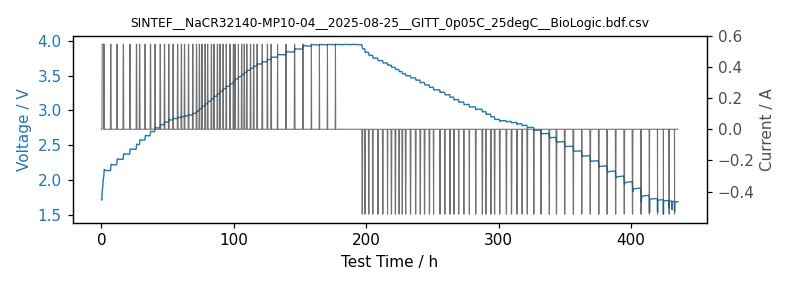

- ✓ raw-vs-artifact: matches fresh conversion
- ✓ derived-column consistency: no findings

.. dropdown:: Column mapping (12 mapped, 20 native columns dropped)

   .. list-table::
      :header-rows: 1
      :widths: 40 40 20

      * - Native column
        - BDF column
        - Conversion
      * - ``Energy charge/W.h``
        - ``Charging Energy / Wh``
        - 1:1
      * - ``I/mA``
        - ``Current / A``
        - x 0.001
      * - ``cycle number``
        - ``Cycle Count / 1``
        - 1:1
      * - ``Energy discharge/W.h``
        - ``Discharging Energy / Wh``
        - 1:1
      * - ``R/Ohm``
        - ``Internal Resistance / ohm``
        - 1:1
      * - ``(Q-Qo)/mA.h``
        - ``Net Capacity / Ah``
        - x 0.001
      * - ``Energy/W.h``
        - ``Net Energy / Wh``
        - 1:1
      * - ``P/W``
        - ``Power / W``
        - 1:1
      * - ``Ns``
        - ``Step ID``
        - 1:1
      * - ``step time/s``
        - ``Step Time / s``
        - 1:1
      * - ``time/s``
        - ``Test Time / s``
        - 1:1
      * - ``Ecell/V``
        - ``Voltage / V``
        - 1:1

   **Dropped (no BDF mapping):** ``mode``, ``ox/red``, ``error``, ``control changes``, ``Ns changes``, ``counter inc.``, ``I Range``, ``control/mA``, ``dq/mA.h``, ``Q charge/discharge/mA.h``, ``half cycle``, ``Temperature/�C``, ``Capacitance charge/�F``, ``Capacitance discharge/�F``, ``x``, ``Q discharge/mA.h``, ``Q charge/mA.h``, ``Capacity/mA.h``, ``Efficiency/%``, ``<empty header>``

neware_csv
----------

1 reference dataset(s) exercising the ``neware_csv`` parser and normalizer.

SINTEF__SLPBA842124HV__2024-10-23__Rate_25degC__Neware__Time_Bug.bdf.csv
~~~~~~~~~~~~~~~~~~~~~~~~~~~~~~~~~~~~~~~~~~~~~~~~~~~~~~~~~~~~~~~~~~~~~~~~

Rate test, LiPo pouch cell, 25 degC.

.. warning::

   **Deliberately imperfect data.** Contains non-monotonic test-time jumps exactly as logged by the cycler. Kept on purpose to demonstrate time-axis repair with bdf.clean.

- **Provider:** SINTEF
- **Rows:** 13,086
- **BDF artifact:** ``docs/examples/reference/SINTEF__SLPBA842124HV__2024-10-23__Rate_25degC__Neware__Time_Bug.bdf.csv`` (sha256 ``90aa25c3852d...``)
- **Raw export:** `SINTEF__SLPBA842124HV__2024-10-23__Rate_25degC__Neware__Time_Bug.csv <https://zenodo.org/api/records/18986774/files/SINTEF__SLPBA842124HV__2024-10-23__Rate_25degC__Neware__Time_Bug.csv/content>`__ (3.0 MiB, md5:e2075f6ffd08ea0d9f1e686cebbf2d1e)

- **Columns:** ``test_time_second``, ``voltage_volt``, ``current_ampere``, ``unix_time_second``, ``cycle_count``, ``step_id``, ``step_time_second``, ``step_charging_capacity_ah``, ``step_discharging_capacity_ah``, ``step_cumulative_capacity_ah``, ``step_charging_energy_wh``, ``step_discharging_energy_wh``

:bdg-success:`PASS` 13,086 rows — 34.9 h — Voltage / V: [2.9995, 4.3501] — Current / A: [-59.4593, 2.1816]

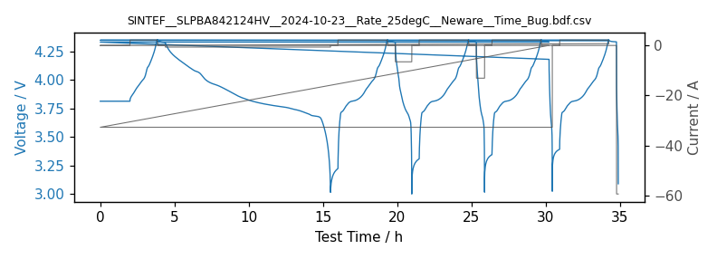

- ✓ raw-vs-artifact: matches fresh conversion
- ✓ derived-column consistency: no findings

.. dropdown:: Column mapping (12 mapped, 22 native columns dropped)

   .. list-table::
      :header-rows: 1
      :widths: 40 40 20

      * - Native column
        - BDF column
        - Conversion
      * - ``Current(A)``
        - ``Current / A``
        - 1:1
      * - ``Cycle Index``
        - ``Cycle Count / 1``
        - 1:1
      * - ``Chg. Cap.(Ah)``
        - ``Step Charging Capacity / Ah``
        - 1:1
      * - ``Chg. Energy(Wh)``
        - ``Step Charging Energy / Wh``
        - 1:1
      * - ``Capacity(Ah)``
        - ``Step Cumulative Capacity / Ah``
        - 1:1
      * - ``DChg. Cap.(Ah)``
        - ``Step Discharging Capacity / Ah``
        - 1:1
      * - ``DChg. Energy(Wh)``
        - ``Step Discharging Energy / Wh``
        - 1:1
      * - ``Step Index``
        - ``Step ID``
        - 1:1
      * - ``Time(s)``
        - ``Step Time / s``
        - 1:1
      * - ``Total Time(s)``
        - ``Test Time / s``
        - 1:1
      * - ``Date``
        - ``Unix Time / s``
        - datetime parse
      * - ``Voltage(V)``
        - ``Voltage / V``
        - 1:1

   **Dropped (no BDF mapping):** ``DataPoint``, ``Step Type``, ``Spec. Cap.(mAh/g)``, ``Chg. Spec. Cap.(mAh/g)``, ``DChg. Spec. Cap.(mAh/g)``, ``Energy(Wh)``, ``Spec. Energy(mWh/g)``, ``Chg. Spec. Energy(mWh/g)``, ``DChg. Spec. Energy(mWh/g)``, ``Power(W)``, ``dQ/dV(mAh/V)``, ``dQm/dV(mAh/V.g)``, ``Contact resistance(mO)``, ``Module start-stop switch``, ``SOC/DOD(%)``, ``LgD``, ``V1(V)``, ``V2(V)``, ``V3(V)``, ``T1(?)``, ``T2(?)``, ``T3(?)``

novonix_csv
-----------

1 reference dataset(s) exercising the ``novonix_csv`` parser and normalizer.

SINTEF__SLPBA842124HV-06__20241011__DCIR__0p1C__25degC__Novonix.bdf.parquet
~~~~~~~~~~~~~~~~~~~~~~~~~~~~~~~~~~~~~~~~~~~~~~~~~~~~~~~~~~~~~~~~~~~~~~~~~~~

DCIR 0.1C protocol, LiPo pouch cell, 25 degC. Stored as a BDF parquet artifact (the raw export is 120 MB; parquet keeps the full 817k rows in 15 MB).

- **Provider:** SINTEF
- **Rows:** 817,551
- **BDF artifact:** ``docs/examples/reference/SINTEF__SLPBA842124HV-06__20241011__DCIR__0p1C__25degC__Novonix.bdf.parquet`` (sha256 ``c861d5a5baf2...``)
- **Raw export:** `SINTEF__SLPBA842124HV-06__20241011__DCIR__0p1C__25degC__Novonix.csv <https://zenodo.org/api/records/18986774/files/SINTEF__SLPBA842124HV-06__20241011__DCIR__0p1C__25degC__Novonix.csv/content>`__ (113.9 MiB, md5:54a40efd324d1dba5995fa4f3e65717d)

- **Columns:** ``test_time_second``, ``voltage_volt``, ``current_ampere``, ``unix_time_second``, ``cycle_count``, ``step_count``, ``step_id``, ``step_type``, ``step_time_second``, ``net_capacity_ah``, ``step_net_energy_wh``, ``power_watt``, ``temperature_t1_celsius``, ``temperature_t2_celsius``

:bdg-success:`PASS` 817,551 rows — 72.45 h — Voltage / V: [2.999, 4.3508] — Current / A: [-19.9997, 19.9996]

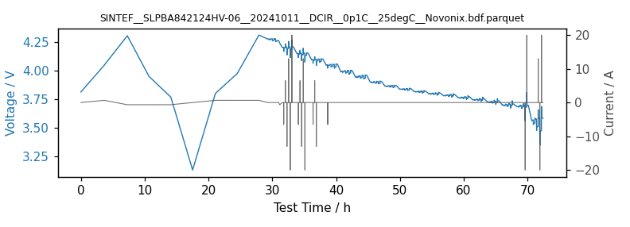

- ✓ raw-vs-artifact: matches fresh conversion
- ✓ derived-column consistency: no findings

.. dropdown:: Column mapping (14 mapped, 2 native columns dropped)

   .. list-table::
      :header-rows: 1
      :widths: 40 40 20

      * - Native column
        - BDF column
        - Conversion
      * - ``Current (A)``
        - ``Current / A``
        - 1:1
      * - ``Cycle Number``
        - ``Cycle Count / 1``
        - 1:1
      * - ``Capacity (Ah)``
        - ``Net Capacity / Ah``
        - 1:1
      * - ``Power(W)``
        - ``Power / W``
        - 1:1
      * - ``Step Number``
        - ``Step Count / 1``
        - 1:1
      * - ``Step position``
        - ``Step ID``
        - 1:1
      * - ``Energy (Wh)``
        - ``Step Net Energy / Wh``
        - 1:1
      * - ``Step Time (h)``
        - ``Step Time / s``
        - x 3600
      * - ``Step Type``
        - ``Step Type``
        - 1:1
      * - ``Temperature (°C)``
        - ``Temperature T1 / degC``
        - 1:1
      * - ``Circuit Temperature (°C)``
        - ``Temperature T2 / degC``
        - 1:1
      * - ``Run Time (h)``
        - ``Test Time / s``
        - x 3600
      * - ``Date and Time``
        - ``Unix Time / s``
        - datetime parse
      * - ``Potential (V)``
        - ``Voltage / V``
        - 1:1

   **Dropped (no BDF mapping):** ``dVdt (V/h)``, ``dIdt (A/h)``

maccor_csv
----------

1 reference dataset(s) exercising the ``maccor_csv`` parser and normalizer.

faraday__lg-INR21700M50-2019-002__2019-06-02__rate__25degC__maccor.bdf.csv
~~~~~~~~~~~~~~~~~~~~~~~~~~~~~~~~~~~~~~~~~~~~~~~~~~~~~~~~~~~~~~~~~~~~~~~~~~

Rate test, LG INR21700-M50 cell, 25 degC.

- **Provider:** Faraday Institution
- **Rows:** 6,313
- **BDF artifact:** ``docs/examples/reference/faraday__lg-INR21700M50-2019-002__2019-06-02__rate__25degC__maccor.bdf.csv`` (sha256 ``9b29f9c63f27...``)
- **Raw export:** `faraday__lg-INR21700M50-2019-002__2019-06-02__rate__25degC__maccor.csv <https://zenodo.org/api/records/18986774/files/faraday__lg-INR21700M50-2019-002__2019-06-02__rate__25degC__maccor.csv/content>`__ (0.6 MiB, md5:0bbf959cbfc367296ec69d7a74d2f5c1)

- **Columns:** ``test_time_second``, ``voltage_volt``, ``current_ampere``, ``unix_time_second``, ``cycle_count``, ``step_count``, ``ambient_temperature_celsius``, ``record_index``, ``step_time_second``, ``step_cumulative_capacity_ah``, ``step_cumulative_energy_wh``, ``temperature_t1_celsius``

:bdg-success:`PASS` 6,313 rows — 48.18 h — Voltage / V: [2.4999, 4.2031] — Current / A: [0.0, 7.5026]

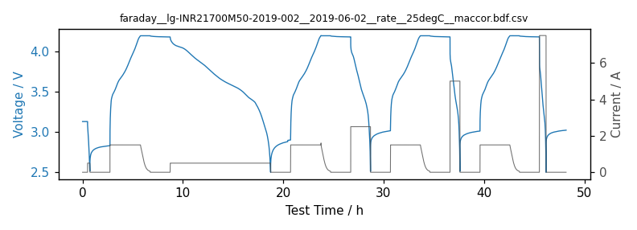

- ✓ raw-vs-artifact: matches fresh conversion
- ✓ derived-column consistency: no findings

.. dropdown:: Column mapping (12 mapped, 3 native columns dropped)

   .. list-table::
      :header-rows: 1
      :widths: 40 40 20

      * - Native column
        - BDF column
        - Conversion
      * - ``Temperature Chamber [degC]``
        - ``Ambient Temperature / degC``
        - 1:1
      * - ``Current [A]``
        - ``Current / A``
        - 1:1
      * - ``Cycle C``
        - ``Cycle Count / 1``
        - 1:1
      * - ``Rec``
        - ``Record Index / 1``
        - 1:1
      * - ``Step``
        - ``Step Count / 1``
        - 1:1
      * - ``Capacity [Ah]``
        - ``Step Cumulative Capacity / Ah``
        - 1:1
      * - ``Energy [Wh]``
        - ``Step Cumulative Energy / Wh``
        - 1:1
      * - ``Step Time [s]``
        - ``Step Time / s``
        - 1:1
      * - ``Temperature Cell [degC]``
        - ``Temperature T1 / degC``
        - 1:1
      * - ``Test Time [s]``
        - ``Test Time / s``
        - 1:1
      * - ``DPT Time``
        - ``Unix Time / s``
        - datetime parse
      * - ``Voltage [V]``
        - ``Voltage / V``
        - 1:1

   **Dropped (no BDF mapping):** ``Cycle P``, ``Md``, ``ES``

arbin_csv
---------

1 reference dataset(s) exercising the ``arbin_csv`` parser and normalizer.

shandong__nacr32140-mp10__2023-10-10__pulse__25degC__arbin.bdf.csv
~~~~~~~~~~~~~~~~~~~~~~~~~~~~~~~~~~~~~~~~~~~~~~~~~~~~~~~~~~~~~~~~~~

Pulse test, sodium-ion cell, 25 degC. Arbin accumulator columns (Charge/Discharge Capacity and Energy) are deliberately absent: their reset points are schedule-authored (verified: resets at scripted steps 9/12/74, cycle index constant), so no test-accumulating BDF term is correct in general. They will return via derivation from current x time.

- **Provider:** Shandong University
- **Rows:** 131,884
- **BDF artifact:** ``docs/examples/reference/shandong__nacr32140-mp10__2023-10-10__pulse__25degC__arbin.bdf.csv`` (sha256 ``3b8d629ecdc6...``)
- **Raw export:** `shandong__nacr32140-mp10__2023-10-10__pulse__25degC__arbin.CSV <https://zenodo.org/api/records/18986774/files/shandong__nacr32140-mp10__2023-10-10__pulse__25degC__arbin.CSV/content>`__ (20.6 MiB, md5:04a0ce9a567624bf72faacabf7bc1be2)

- **Columns:** ``test_time_second``, ``voltage_volt``, ``current_ampere``, ``unix_time_second``, ``cycle_count``, ``step_id``, ``record_index``, ``step_time_second``, ``power_watt``, ``dc_internal_resistance_ohm``, ``ac_internal_resistance_ohm``, ``temperature_t1_celsius``

:bdg-success:`PASS` 131,884 rows — 25.7 h — Voltage / V: [-0.0422, 4.0505] — Current / A: [-30.0045, 30.0035]

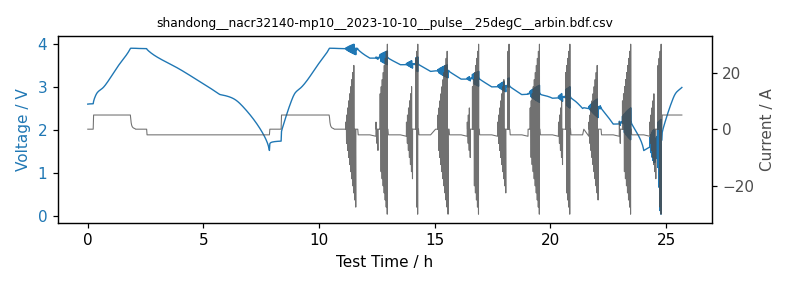

- ✓ raw-vs-artifact: matches fresh conversion
- ✓ derived-column consistency: no findings

.. dropdown:: Column mapping (12 mapped, 14 native columns dropped)

   .. list-table::
      :header-rows: 1
      :widths: 40 40 20

      * - Native column
        - BDF column
        - Conversion
      * - ``ACR (Ohm)``
        - ``AC Internal Resistance / ohm``
        - 1:1
      * - ``Current (A)``
        - ``Current / A``
        - 1:1
      * - ``Cycle Index``
        - ``Cycle Count / 1``
        - 1:1
      * - ``Internal Resistance (Ohm)``
        - ``DC Internal Resistance / ohm``
        - 1:1
      * - ``Power (W)``
        - ``Power / W``
        - 1:1
      * - ``Data Point``
        - ``Record Index / 1``
        - 1:1
      * - ``Step Index``
        - ``Step ID``
        - 1:1
      * - ``Step Time (s)``
        - ``Step Time / s``
        - 1:1
      * - ``Aux_Temperature_1 (C)``
        - ``Temperature T1 / degC``
        - 1:1
      * - ``Test Time (s)``
        - ``Test Time / s``
        - 1:1
      * - ``Date Time``
        - ``Unix Time / s``
        - datetime parse
      * - ``Voltage (V)``
        - ``Voltage / V``
        - 1:1

   **Dropped (no BDF mapping):** ``TC_Counter1``, ``TC_Counter2``, ``TC_Counter3``, ``TC_Counter4``, ``Charge Capacity (Ah)``, ``Discharge Capacity (Ah)``, ``Charge Energy (Wh)``, ``Discharge Energy (Wh)``, ``Capacity (Ah)``, ``mAh/g``, ``dV/dt (V/s)``, ``dQ/dV (Ah/V)``, ``dV/dQ (V/Ah)``, ``Aux_dT/dt_1 (C/s)``

Raw files without a committed BDF equivalent
--------------------------------------------

- `tum__bak-n18650ck-202204-044__cycle__45degC__basytec.txt <https://zenodo.org/api/records/18986774/files/tum__bak-n18650ck-202204-044__cycle__45degC__basytec.txt/content>`__ (246.2 MiB) -- Converts cleanly with the basytec_txt plugin, but the 258 MB raw yields a 58 MB BDF CSV — larger than we commit to the repository. Regenerate locally with scripts/generate_zenodo_reference_bdf.py if needed.
- `tum__bak-n18650ck-202204-001__characterization__25degC__biologic.txt <https://zenodo.org/api/records/18986774/files/tum__bak-n18650ck-202204-001__characterization__25degC__biologic.txt/content>`__ (2.0 MiB) -- BioLogic TXT export with ragged rows that the biologic_mpt parser does not handle yet.
- `stanford__a123- ANR26650m1B-2020-k1__1C__25degC__arbin.xlsx <https://zenodo.org/api/records/18986774/files/stanford__a123-%20ANR26650m1B-2020-k1__1C__25degC__arbin.xlsx/content>`__ (1.1 MiB) -- Arbin Excel export; no Arbin-Excel plugin exists yet (the generic Excel parser expects a 'record' sheet).
- `sintef__energizer-cr2032-202602-dtjrga__2026-02-25__c100__RT__landt.ccs <https://zenodo.org/api/records/18986774/files/sintef__energizer-cr2032-202602-dtjrga__2026-02-25__c100__RT__landt.ccs/content>`__ (9.7 MiB) -- LANDT binary .ccs container; no BDF parser exists for it yet.

.. END GENERATED: reference-datasets
